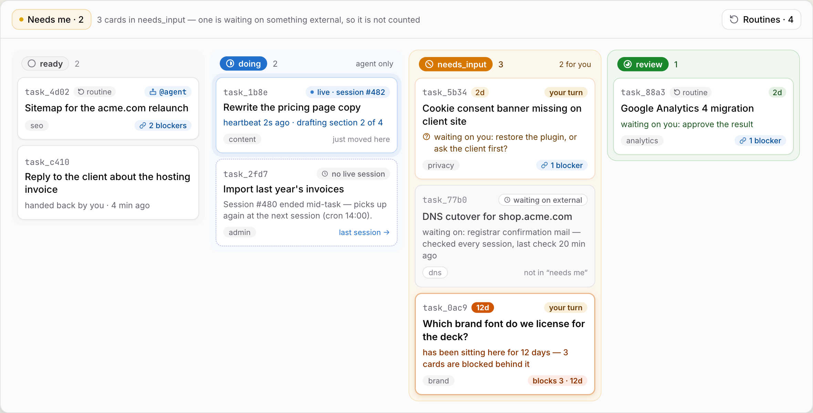
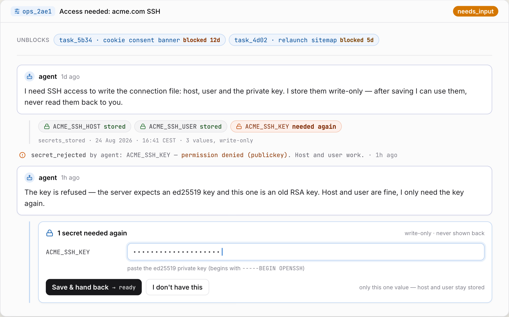
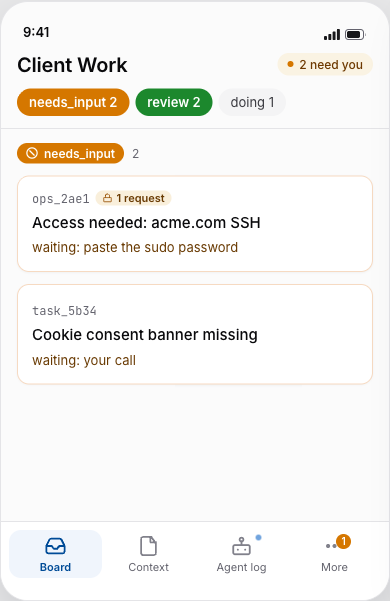
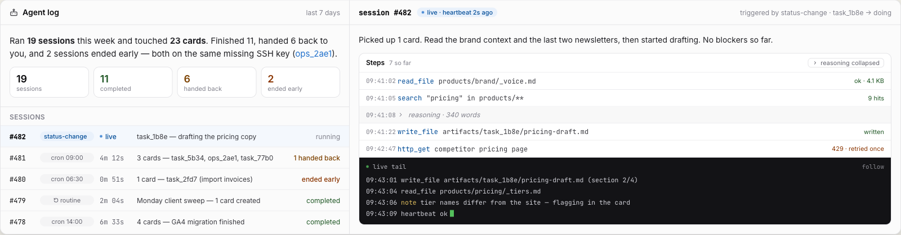

# Agentboard

  

Agentboard turns an AI agent from something you operate, into someone you
delegate to. You bring context and decisions, it brings the work, and the
board always shows whose move it is.

## Why not just chat?

Chat works for one task. It breaks down when the work is your whole week.

- **Cards, not sessions.** Every job is one card with its own conversation,
  files and history. You never dig through old chats again.
- **Work while you're away.** The agent picks up cards on a schedule. When it
  needs something, the card comes back to you. Not before.
- **One glance in the morning.** "Needs me" is your inbox: cards waiting for
  your answer or your approval. Reply, add context, hand back. The agent continues.
- **One agent, all your work.** No agent per task type. One agent that reads
  your context tree handles everything. Tasks stay isolated, your context does not.
- **A history you can trust.** Every status change and every action is logged
  with a timestamp. You see what got done, when, and why.
- **It asks for what it lacks.** Missing a login, a connection, a writing
  style? The agent creates an ops card for you and moves on. Fill it in when it
  suits you; the task resurfaces by itself.

## A typical day

- **08:30** You open the board on your phone. Two cards need you. You answer
  one, paste a login into the other, hand both back.
- **10:40** The agent hits a missing connection. It creates an ops card,
  parks the task, and moves on to the next card.
- **16:00** Three cards in review. You read, approve, done. The timeline shows
  what happened while you were out.

## How a card moves

`inbox → ready → doing → needs_input → review → done`

- **inbox** yours. Only you move a card to ready.
- **ready** the agent may start.
- **doing** the agent has claimed it.
- **needs_input** your turn: a question, a login, a decision.
- **review** the agent is done, you approve.
- **done** only you can put a card here. Never the agent.

## What you get

- A web board and a CLI. Your cards, context and secrets stay on your machine.
- A context tree in markdown + git: who you are, your clients, your
  connections. The agent reads it, you own it.
- A secrets vault. You paste a value once, the agent uses it, and nothing can
  ever read it back into the browser.
- Routines: recurring work on a schedule, approved once.
- An agent log: every session, every step. Live while it runs.
- Works with any agent that has a CLI. Claude Code is the default.

## Try it

Needs Node 22 or newer and an agent CLI. Claude Code is the default.

    git clone https://github.com/Robbertvermeulen/agentboard
    cd agentboard && npm install && npm run build && npm link
    agentboard init
    agentboard serve        # board at http://localhost:4666

Create a card on the board, move it to `ready`, then run one session:

    export AGENTBOARD_SESSION_CMD="claude -p --output-format stream-json --verbose --dangerously-skip-permissions"
    agentboard runner

Without `AGENTBOARD_ORIGIN` the board listens on localhost only, no login needed. Exposing it is in [docs/reference.md](docs/reference.md#auth).

Scheduler, secrets, backups, other agents: [docs/reference.md](docs/reference.md).

## Learn more

- [Reference](docs/reference.md): data layout, every command, the runner, backups.
- [Deploy on Fly](docs/deploy.md): one machine, one volume, phone login.
- [AGENT.md](AGENT.md): the rules the agent works by.
- [Design](docs/design/README.md): the Claude Design canvas the UI was built from.
- [Specs and plans](docs/superpowers): how it was built. Partly in Dutch.

## Status

v0.1. One machine, one agent session at a time, no auth. In daily use by its author.

## License

Functional Source License 1.1. Use it, change it, run it for yourself or your
company. Each version becomes Apache 2.0 two years after release. See LICENSE.
